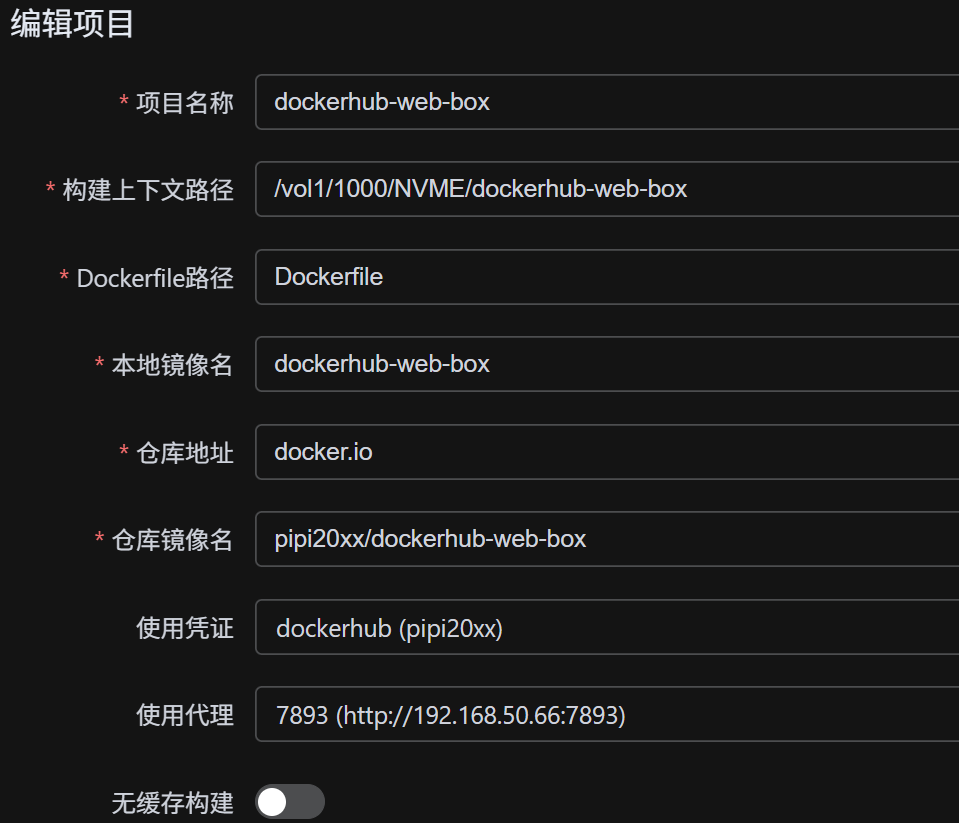

# Docker Web Pusher



**Docker Web Pusher** 是一个基于 Web 的 Docker 镜像管理与推送工具。它提供了一个直观的图形界面，帮助用户轻松管理 Docker 项目、构建镜像、备份数据，并一键推送到远程仓库。

## 🚀 核心特性

- **可视化项目管理**：轻松创建和编辑 Docker 项目配置。
- **✨ 统一 Buildx 构建架构**：全面采用 Docker Buildx 引擎，无论是单架构还是多架构（`amd64`, `arm64`, `riscv64` 等），均通过 Buildx 提供高性能、一致性的构建体验。
- **✨ 智能私有仓库支持**：
    - **自动识别**：自动检测 HTTP 或私有 IP 的仓库地址。
    - **零配置**：无需手动设置 `insecure-registries`，系统会自动为特定仓库创建配置完美的隔离构建环境（Builder）。
    - **持久化加速**：针对不同仓库（Host）自动创建专属的持久化 Builder，复用本地缓存，实现秒级二次构建。
- **✨ 高级缓存策略**：
    - **Registry Inline Cache**：默认启用内联缓存，将构建缓存推送到远程仓库，支持跨机器复用。
    - **智能 No-Cache**：勾选“无缓存”时，强制忽略旧缓存并全量重构，但仍会写入新缓存以造福下次构建。
- **✨ 多标签一次性推送**：支持使用 `|` 或逗号分隔多个 Tag（如 `v1|latest`），一次构建，全量推送。
- **✨ 自动清理功能**：支持构建成功后自动删除本地镜像标签，有效节省宿主机磁盘空间。
- **网络代理支持**：支持配置 HTTP/HTTPS 代理，通过原生 Build Argument (`HTTP_PROXY`) 注入，无需修改 Dockerfile。
- **本地备份管理**：支持镜像的本地备份与恢复（支持 7z 高效压缩）。
- **实时日志监控**：通过 WebSocket 提供实时的构建（包含 Buildx 过程）与推送日志流。

## 🛠️ 技术栈

本项目采用现代化的前后端分离架构：

- **前端**：Vue 3, Element Plus, Pinia, Vite
- **后端**：Python 3.11, FastAPI, SQLAlchemy, Docker SDK, Buildx CLI
- **部署**：Docker, Docker Compose (多阶段构建)

## 📦 安装与使用

### 前置要求

- 操作系统：Linux (推荐), macOS, Windows (WSL2)
- 环境依赖：Docker Engine, Docker Compose

### 快速开始

创建一个 `docker-compose.yml` 文件：

```yaml
services:
  docker-pusher:
    image: pipi20xx/dockerhub-web-box
    container_name: dockerhub-web-box
    ports:
      - "7222:8000"
    volumes:
      - ./data:/app/data    # 数据存储
      - /var/run/docker.sock:/var/run/docker.sock # 映射 docker 核心
      - /your/projects:/projects # 挂载你需要构建的项目路径
    environment:
      - TZ=Asia/Shanghai
    restart: unless-stopped
```

1. **启动服务**：`docker-compose up -d`
2. **访问应用**：打开浏览器访问 `http://localhost:7222`

## 💡 高级用法说明

### 1. 多架构构建与 QEMU
系统已内置全自动的 Buildx 管理逻辑。
- **HTTP/私有仓库**：系统会自动检测并创建名为 `builder-priv-<HOST>-<HASH>` 的专用构建器，自动处理 HTTPS 证书信任问题。
- **多架构支持**：如果您需要在 x86 服务器上构建 ARM 镜像，请确保宿主机已安装 QEMU 支持。您可以点击界面上的 **[一键修复环境]** 来自动安装 QEMU 模拟器 (`binfmt_misc`)。

### 2. 多标签输入规范
在项目的 Tag 输入框中，您可以灵活使用以下分隔符：
- **竖线 (推荐)**：`v1.0|latest`
- **逗号**：`v1.0,latest` 或 `v1.0，latest` (支持全角)

### 3. 缓存与清理
- **默认行为**：系统会尝试从远程仓库拉取之前的缓存层（如果存在），并将本次构建的缓存写入镜像中。
- **强制无缓存**：在构建选项中勾选 `No Cache`，系统将强制重新运行所有构建步骤，不读取旧缓存。
- **自动清理**：开启后，系统会在推送完成后自动清理本地产生的临时 Tag，但**保留** Buildx 的内部缓存（Build Cache），以确保下次构建依然飞快。

## 📂 目录结构

```text
/dockerhub-web-box/
├── backend/            # Python FastAPI 后端
├── frontend/           # Vue.js 前端
├── data/               # 持久化数据 (数据库, 备份, 日志)
├── Dockerfile          # 多阶段构建文件 (内置 Docker CLI)
└── docker-compose.yml  # Compose 配置文件
```

## 🛡️ 安全提醒

- **Docker Socket**：本工具需要挂载 `/var/run/docker.sock`。请确保仅在受信任的网络环境中使用，或为 Web 界面增加一层 Nginx 基础认证。

## 📄 许可证

本项目开源，遵循 MIT License。
